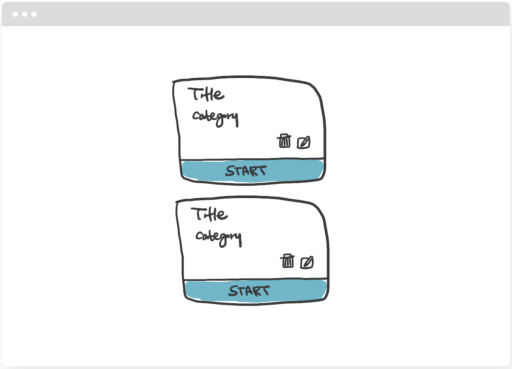
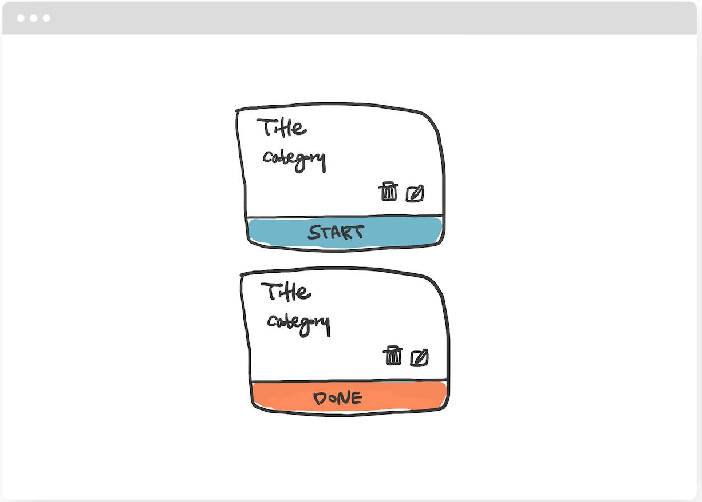
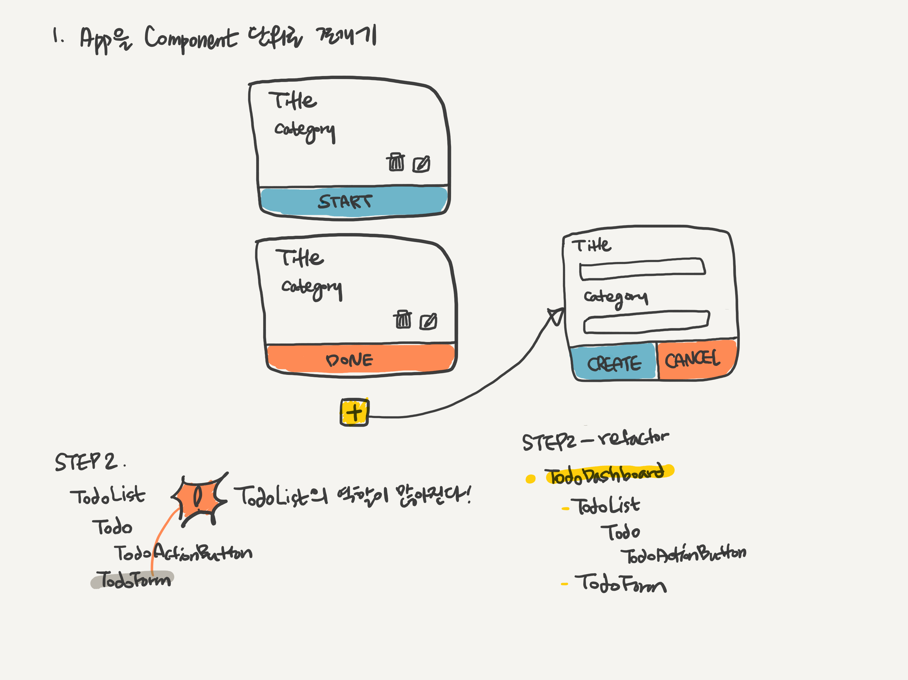
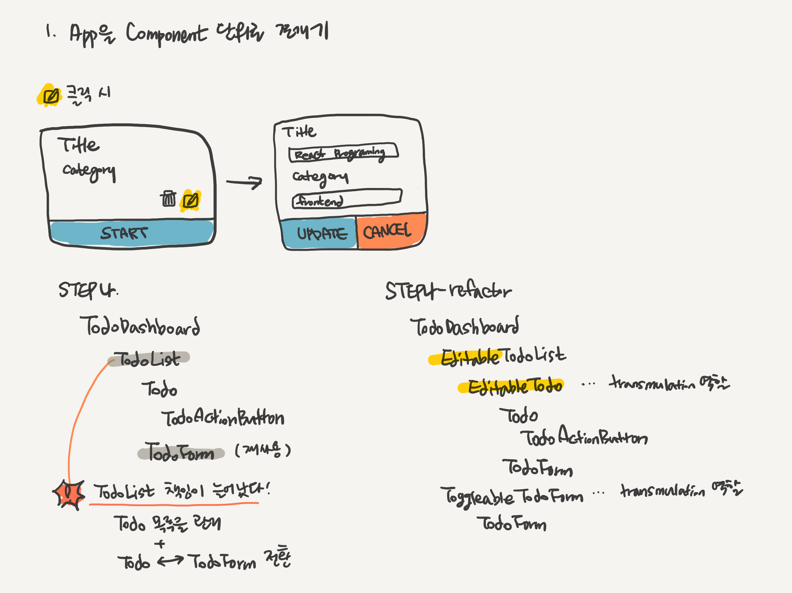
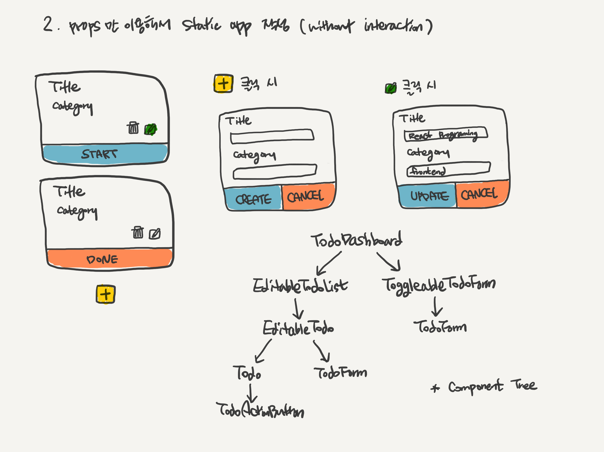
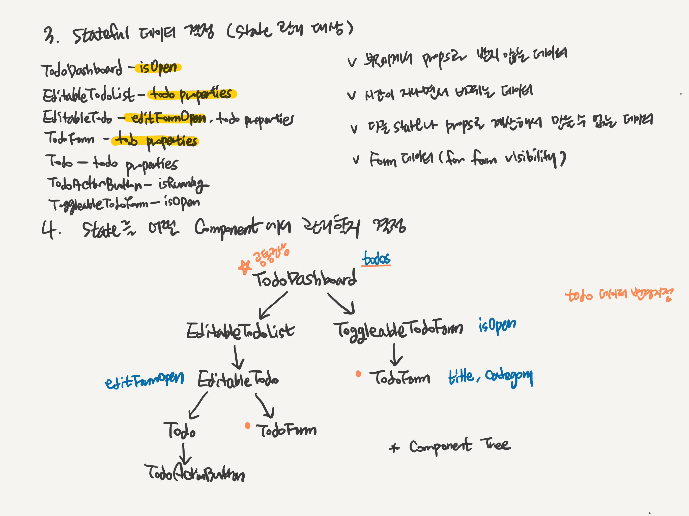

# React Web App 개발 가이드
## 개선 포인트
- 공통된 언어가 없다.
- 내가 작성한 코드가 아니면 한 눈에 읽히지 않는다.
- 개발 속도를 높이려면.. **공통 언어**와 **기본적인 코딩 순서**에 대한 프로세스가 필요하다. 마치 스프링에서 controller->service->dao 순서로 개발하는 것처럼

## Table of Contents
- React
  - React App 개발, 체계적으로 접근하기
  - React Component Naming Rule
- CSS
  - BEM 패턴을 이용한 CSS Naming Rule
  - SCSS with BEM 작성 방법 

### 컴포넌트 잘쪼개는게 중요한 이유?
**재사용성**, 컴포넌트를 심플하게 만들어 **확장성**이 높아진다.

### 왜 Naming Rule이 있어야 하고 이름을 잘 지어야 하나?

팀원이 사용하는 언어에 대해 일관된 규칙을 적용해야 **커뮤니케이션**이 용이하다.  
그리고 **코드의 명확성**이 크게 높아진다. 

## React App 개발, 체계적으로 접근하기
### 0단계. 스토리 목록
    - Todo 카드가 여러 개 보여야 한다.
    - Todo 카드 버튼을 클릭하면 상태가 바뀐 버튼이 보여야 한다. (Start -> In Progress -> Done -> Success!)
    - 새로운 Todo 카드(title, category)를 추가할 수 있다.
    - 카드 추가 버튼을 클릭하면 새로운 Todo 카드(title, category)를 추가할 수 있는 입력폼이 보여야 한다.
    - 카드 편집 버튼을 클릭하면 이미 등록한 Todo 카드(title, category)를 수정할 수 있는 입력폼이 보여야 한다.
    - 이미 등록한 Todo 카드를 삭제할 수 있다.

### 1단계. 눈에 보이는 그대로 App UI를 작은 덩어리(Component 단위)로 쪼갠다.

덩어리로 쪼갠 UI Component는 대부분 React Component와 1:1로 매핑된다.

UI 컴포넌트를 React 컴포넌트로 분해하기를 반복할 때 **Single Responsibility Principle**만 기억하면 된다.  
하나의 React 컴포넌트가 여러 역할을 하지 않도록 구성한다.

#### Task 1

위에 그림처럼 카드가 두개 있는 목록을 React App으로 제작한다고 생각하자.

먼저 시각적인 UI Compoment들을 논리적으로 쪼개면 카드 내용과 버튼을 보여주는 `Card` 컴포넌트와  Card 컴포넌트 목록을 보여주는 `CardList`로 구분할 수 있다.

React Component Tree와 Component 역할은 다음과 같다.
```
Task 1 결과

* CardList: display list of cards
  * Card: display a card
```

#### Task 2

그런데 하나의 Card 컴포넌트 안에 두가지 타입의 버튼이 존재한다. 

즉 Start 버튼 클릭이라는 사용자 입력 조건에 따라 Card 컴포넌트가 렌더링하는 버튼 색깔과 텍스트가 바껴야 한다.

이렇게 버튼을 바꿔치기(transmulation) 하는 로직을 평범하게 Card 컴포넌트 안에서 처리할 수도 있다.

그러나 **새로운 Component를 만들어 어떤 버튼을 렌더링할 지 결정하는 책임을 Card 컴포넌트로부터 분리**하는 것이 기능 확장성과 재사용성 면에서 이점이 있다.

새롭게 만든 Component는 사용자 입력을 Button으로 받아 처리하므로 `CardActionButton`이라고 지었다.

이를 적용한 React Component Tree는 다음과 같다.

    Task 2 결과

    - CardList: display list of cards
      - Card: display a card
        * CardActionButton: decide which button is displayed depending on user's input

#### 잠깐 생각해보기 
    - directory layout
    아직까지 CardActionButton 컴포넌트는 Card 컴포넌트 안에서만 사용되므로 CadActionButton.js 파일은 Card/Card.js과 함께 Card/ 안에 두면 좋을 것 같다.

    - component naming rule
    사용자 액션이 발생하는 컴포넌트는 -Button, -Form이라는 suffix를 붙여서 구분했다.

#### Task 3


카드 추가를 위한 + 버튼은 어느 컴포넌트에 넣어야 할까?

Task 2의 Component Tree에서 보면 `CardList` 하위에 넣는 것이 적당해 보일 수 있다.

그런데 `CardList`는 Card 목록을 보여주는 역할을 담당하고 있다.  
새로운 카드를 추가하는 역할까지 부여한다면 `CardList`는 단일 책임 원칙에 어긋나게 된다.

이럴 때에는 새로운 Component로 분리하고 기존에 만들어진 컴포넌트들을 묶어주기 위한 Container Component를 만드는 것이 일반적이다. 

새로운 카드를 추가할 때 사용자로부터 카드 내용을 입력 받는 폼이 필요하고 액션이 발생하기 때문에 컴포넌트 이름을 `CardForm`이라고 지었다.

`CardList`와 `CardForm`을 포함하는 Container Component 이름은 카드 현황을 보여주므로 `CardsDashboard`라고 지었다.

UI에서 보이듯이 이 컴포넌트는 `CardList`의 하위 컴포넌트가 아니라 동일한 레벨로 구성되어야 맞다.

이를 적용한 React Component Tree는 다음과 같다.

    Task 3 결과

    * CardsDashboard: top-level container
      - CardList: display list of cards
        - Card: display a card
          - CardActionButton: decide which button is displayed depending on user's input
      * CardForm: display card's form to create a new card

#### Task 4
를 추가할 수 있는 입력폼이 보여야 한다.")

Task 3의 결과로 `CardForm` 컴포넌트는 + 버튼과 새로운 카드를 추가하기 위한 입력폼을 렌더링할 수 있게 만들어졌다.  

그런데 사실 한가지 책임을 더 갖고 있다. 바로 언제 + 버튼을 렌더링할지, 언제 카드 추가 입려폼을 렌더링해야 하는지 결정하는 책임도 갖고 있다.

Task 2에서 `Card` 컴포넌트에서 버튼을 `CardActionButton`으로 분리한 이유와 같이 **언제 어떤 뷰를 렌더링 해야하는지 결정하는 책임을 `CardForm`으로부터 분리**하는 것이 좋다.

어떤 뷰를 렌더링할지 결정하는 로직을 어떤 부모 컴포넌트에게 담아야 할까? 

`CardForm`의 부모 컴포넌트는 현재 `CardsDashboard` 이다. 여기서 하는게 맞을까? 이 로직을 굳이 최상위 컴포넌트까지 호이스트할 필요가 없다. 

따라서 새로운 Container Component를 만들어 렌더링할 뷰를 선택하도록 만드는 것이 좋다. 이제야 비로소 `CardForm`은 카드 추가 입력폼만 렌더링하게 되었다.

이름은 상태를 토글할 수 있는 컴포넌트라는 의미에서 `ToggleableCardForm`으로 지었다.

이를 적용한 React Component Tree는 다음과 같다.

    Task 4 결과

    - CardsDashboard: top-level container
      - CardList: display list of cards
        - Card: display a card
          - CardActionButton: decide which button is displayed depending on user's input
      * ToggleableCardForm: decide which element is displayed
        - CardForm: display card's form to create a new card

#### 잠깐 생각해보기 
    - directory layout
    CardList나 ToggleableCardForm은 Container Component 역할에 더 가깝지 않을까? 그러니 CardsDashboard와 같은 directory로 구성하고 Card와 CardForm은 재사용이 가능한 독립적인 컴포넌트이니 별도의 directory로 구성하면 어떨까? 이 결정은 Redux까지 좀 더 파악한 후에 다시 하기로.

#### Task 5


수정을 위한 입력폼은 추가 입력폼과 동일한 뷰를 가지므로 `CardForm` 컴포넌트를 재사용할 수 있다.

이 `CardForm` 컴포넌트는 `Card`와 동일한 레벨로 렌더링되므로 `CardList` 하위 컴포넌트로 구성된다.

아래와 같은 Component Tree가 만들어진다.
    
    Task 5 중간 결과

    - CardsDashboard: top-level container
      - CardList: display list of cards
        - Card: display a card
          - CardActionButton: decide which button is displayed depending on user's input
        * CardForm: display card's form to edit a given card
      - ToggleableCardForm: decide which element is displayed
        - CardForm: display card's form to create a new card

그던데 이번에도 Task 2, Task 4와 같이 연필 아이콘을 클릭하면 다른 유형의 뷰를 렌더링(Card -> CardForm)해야 하는 스토리다. (transmulation)

두 컴포넌트 중 어떤 것을 렌더링할지 결정하는 로직을 어떤 부모 컴포넌트에 넣어야 할까? `CardList`?

SRP에 따라 새로운 컴포넌트를 만들고 `CardList`는 Card 목록만 렌더링하도록 유지해야 한다.

새로 만든 컴포넌트는 수정할 수 있는 상태의 카드라는 의미로 `EditableCard` 이라고 지었다.

이에 맞춰 `CardList` 컴포넌트도 `EditableCardList`로 이름을 재정의 한다.

이를 적용한 React Component Tree는 다음과 같다.

    Task 5 최종 결과

    - CardsDashboard: top-level container
      * EditableCardList: display list of cards
        * EditableCard: decide which child compoenent is displayed
          - Card: display a card
            - CardActionButton: decide which button is displayed depending on user's input
          * CardForm: display card's form to edit a given card  
      - ToggleableCardForm: decide which element is displayed
        - CardForm: display card's form to create a new card

#### 잠깐 생각해보기 
    - component naming layout
    부모 컴포넌트는 자식 컴포넌트 이름을 포함해야 의미가 더 명확해진다. 그리고 더 넓은 의미(상태 등)를 가져야 한다.

이제 STEP1. App UI를 React Component로 쪼개는 작업이 끝났다.

### 2단계. prop만을 이용해 정적인 App을 작성 (without interaction, data-flow from parent to child)

완성된 Component Tree는 다음과 같다.


```
                                                  +---------+---------+
                                                  |   CardsDashboard  |
                                                  +---------+---------+
                                   +------------------------+------------------------+        
                                   |                                                 |
                        +----------+---------+                            +----------+---------+ 
                        |  EditableCardList  |                            | ToggleableCardForm |
                        +----------+---------+                            +----------+---------+
                                   |                                                 |
                        +----------+---------+                            +----------+---------+
                        |    EditableCard    |                            |      CardForm      |
                        +----------+---------+                            +----------+---------+ 
                                   |
                    +--------------+--------------+
                    |                             |
         +----------+---------+        +----------+---------+
         |        Card        |        |      CardForm      |
         +----------+---------+        +--------------------+
                    |
         +----------+---------+           
         |  CardActionButton  |                      
         +--------------------+           
```
먼저 1단계에서 구성한 Component Tree 구조를 확인하기 위해 정적인 웹앱을 만들어 본다.  

부모 컴포넌트는 prop을 통해서 자식 컴포넌트에게 하드 코딩된 데이터를 전달한다.  

아직 event propagation을 위한 prop 메서드는 작성하지 않는다.

[소스보기](./src/app-static.js "app-static.js")


### 3단계. stateful data를 결정한다.

stateful data로 만든다는 의미는 쉽게 말해 state로 관리한다는 의미이다.

state로 관리할 데이터와 그렇지 않은 데이터를 나누는 이유는 서로 다른 부분 트리에서 같은 데이터를 변경할 수 있기 때문에 그 데이터를 변경할 수 있는 권한을 하나의 컴포넌트에만 주기 위해서이다.

예를 들어 title, category 데이터는 `ToggleableCardForm` 하위의 `CardForm`과 `EditableCard` 하위의 `CardForm`에서 모두 변경이 가능하다.  
그리고 그 변경이 발생할 때마다 `EditableCard` 하위의 `Card`에 반영되어야 한다.

만약 서로 다른 부모를 가지는 각 `CardForm`이 title, category 데이터를 마음대로 변경할 수 있게 한다면 이 데이터에 의존성을 가지는 컴포넌트들 간의 sync가 깨질 확률이 높아지게 된다.  

따라서 어떤 데이터가 stateful하게 관리되어야 하는지 결정하는 것은 매우 중요하다.

결정하는 기준은 다음과 같다. 다음 기준들을 만족하면 state로 관리되어야 한다.
- 부모 컴포넌트에게서 prop로 받지 않는 데이터
- 시간이 지나면서 바뀌는 데이터
- 다른 state나 prop으로 계산해서 만들 수 없는 데이터 
- input field 등의 Form 데이터

2단계에서 작성한 static app을 보면서 각 컴포넌트가 어떤 데이터를 사용하고 있는지 나열해본다.

CardsDashboard - isOpen (v)
EditableCardList - card properties (v)
EditableCard - editFormOpen (v)), card properties 
CardForm - card properties(v)
Card - card properties
CardActionButton - status
ToggleableCardForm - isOpen (v)

### 4단계. state를 어떤 컴포넌트에서 관리할지 결정한다.

3단계에서 결정한 stateful 데이터를 어떤 컴포넌트에서 관리하는 것이 적합한지 결정하는 단계다.

#### Task 1
cards 데이터들은 최상위 컴포넌트인 `CardsDashboard`에서 관리하는 것이 옳다. 왜냐하면 하위 컴포넌트인 `EditableCardList`와 `ToggleableCardForm` 트리쪽에서 모두 cards 데이터 변경 이벤트가 발생하고 prop으로 전달되어 렌더링되기 때문에 공통 조상인 `CardsDashboard`에 cards state가 있어야 한다.

#### Task 2

`isOpen` prop은 카드 추가 입력폼을 보일지 말지 결정한다. 이것은 최상위 컴포넌트 `CardsDashboard`가 관리할 필요가 없다. 왜냐하면 다른쪽 부분 트리에서 이 데이터에 의존하고 있지 않기 때문이다.  

따라서 + 버튼을 보여줄지 `CardForm`을 보여줄지 결정하는 `ToggleableComponent`가 state로 가지고 있으면 된다.

변경 전
```jsx
class CardsDashboard extends Component {
    render() {
        return (
            <div>
                <EditableCardList />
                <ToggleableCardForm isOpen={false}/>
            </div>
        )
    }
}

class ToggleableCardForm extends Component {
    render() {
        if (this.props.isOpen) {
            return <CardForm/>;
        } else {
            return (
                <button>
                  <i className="plus icon"/>
                </button>
            )
        }
    }
}
```

변경 후 미리보기 
```jsx
class ToggleableCardForm extends Component {
    state = {
        isOpen: false,
    };

    render() {
        if (this.state.isOpen) {
            return <TodoForm />;
        } else {
            return (
                <div>
                    <button>
                        <i className="plus icon"/>
                    </button>
                </div>
            )
        }
    }
}
```

#### Task 3
`editForOpen` prop도 마찬가지로 다른 컴포넌트가 이 prop을 사용하지 않기 때문에 `EditableCard` 컴포넌트가 state로 관리하는 것이 적합하다.

만약 요구사항이 모든 카드 목록에서 하나만 수정할 수 있다 라는 조건이 붙는다면 `EditableCardList`에서 관리되어야 한다.

변경 전
```jsx
class EditableCardList extends Component {
    render() {
        return (
                <div id="cards">
                    <EditableCard title="React Programming" category="Frontend" running={false} editFormOpen={false}/>
                </div>
        )
    }
}

class EditableCard extends Component {
    render() {
        if (this.props.editFormOpen) {
            return (
                <CardForm .../>
            )
        } else {
            return (
                <Card .../>
            )
        }
    }
}
```
변경 후 미리보기 
```jsx
class EditableTodo extends Component {
    state = {
        editFormOpen: false,
    };

    render() {
        if (this.state.editFormOpen) {
            return (
                <CardForm .../>
            )
        } else {
            return (
                <Card .../>
            )
        }
    }
}
```

#### Task 4
input HTML element에서 발생하는 변경사항은 React가 캐치하지 못하기 때문에 입력폼을 렌더링하는 컴포넌트에서 직접 state를 선언해줄 필요가 있다.

다시 말하면 HTML element에 React에서 제공하는 onChange 속성을 통해 입력값이 변경하는 것을 캐치하고 그것을 state에 담아놓아야 브라우저와 state간의 sync를 맞추고 뷰를 갱신할 수 있다.

변경 전
```jsx
class CardForm extends Component {
    render() {
        return (
            <div>
              <div>
                  <label>Title</label>
                  <input type="text" defaultValue={this.props.title} />
              </div>
              <div>
                  <label>Category</label>
                  <input type="text" defaultValue={this.props.category} />
              </div>
            </div>
        )
    }
}
```

변경 후 미리보기 
```jsx

class TodoForm extends Component {
    state = {
        title: this.props.title || '',
        category: this.props.category || '',
    };

    render() {
        return (
            <div>
              <div>
                  <label>Title</label>
                  <input type="text" value={this.state.title} onChange={this.handleTitleChange}/>
              </div>
              <div>
                  <label>Category</label>
                  <input type="text" value={this.state.category} onChange={this.handleCategoryChange}/>
              </div>
            </div>
        )
    }
}
```

### 5단계. state 데이터를 하드코딩한다. (parent -> child prop 메서드 작성)
아직 서버로부터 데이터를 받는 작업을 하기 전에 3~4단계에서 결정한 내용을 2단계 결과물에 적용한다.

state 데이터를 하드코딩에서 구현하고 props에서 state로 변경이 필요한 코드부분을 모두 리팩토링한다. 또한 부모 컴포넌트에서 자식 컴포넌트로 향하는 prop 메서드를 모두 정의힌다.

### 6단계. inverse data-flow를 작성한다. (child -> parent event propagation 작성)

이제 자식 컴포넌트에서 발생하는 사용자 이벤트를 부모 컴포넌트로 전달하기 위한 이벤트 핸들러 메서드를 작성한다.

### 7단계. 서버로부터 데이터 받는 작업을 수행한다.

Later

## React Component Naming Rule

### Component Naming Rule

#### 필수 
- export 하고 있는 컴포넌트 이름으로 파일 이름을 짓는다
- React 컴포넌트 이름, 폴더명은 대문자로 시작, camelCase로 짓는다

#### 기본
- 상위 컴포넌트는 하위 컴포넌트이름을 포함한다.
- 목록 아이템   X
- 목록        XList
- 사용자 입력/액션이 발생하는 컴포넌트 -Form, -Button, ..
- transmulation을 담당하는 컴포넌트는 상태를 앞에 붙여준다. (Toggleable-, Editable-)

#### 선택
- 렌더링만 하는 컴포넌트는 -View를 붙인다.

#### 컴포넌트명 예시
- CardList 
- Card
- CardActionButton
- CardForm
- EditableCard


### Event Handler method naming rule

#### 필수 
- Props로 전달되는 메서드는 on으로 시작한다
- 이벤트 핸들러는 handle로 시작한다

#### 선택 
- Custom component method는 arrow function으로 작성해서 this binding을 명시적으로 하지 않는다.

```jsx
class ParentComponent extends Componet {
  handle이벤트명 = () => {

  };

  render() {
    return (
      <ChildComponent on이벤트명={this.handle이벤트명 />
    )
  }
}

class ChildComponent extends Componet {
  handle이벤트명 = () => {

  };

  render() {
    return (
      <ChildComponent on이벤트명={this.handle이벤트명 />
    )
  }
}
```

이벤트명 예시 
- onFormClose
- onFormOpen
- onFormSubmit
- onCreateFormSubmit
- onEditFormSubmit
- onEditClick
- onTrashClick

우리의 룰은???

## BEM 패턴을 이용한 CSS Naming Rule
  
  (Block-Element-Modifier)

### CSS Namining 기본 규칙 
- 원칙1. 이름만 보고도 **용도**를 알 수 있아야 함
- 원칙2. 이름을 보고 **어디에 쓸 수 있을지** 알 수 있아야 함
- 원칙3. 이름을 보고 **HTML element간의 관계**를 알 수 있어야 함

### BEM 이란 
- Block(블럭, 부모), Element(요소, 자식), Modifier(변환자)
- 코딩 스타일이 아닌 패턴

#### BEM 목표 
- 빠른 개발 속도, 효율적인 구조와 커뮤니케이션 확립, 학습 곡선없이 바로 작업 환경 조성, 재사용 가능한 모듈 개발, 시간이 지나도 유지보수 가능하게 

#### Unified Data Domain
- 팀원이 개별적으로 일하는게 아니라 팀원이 함께 Block의 이름을 함께 짓고 이 용어를 공통적으로 사용하는 것

#### reference
- https://www.slideshare.net/UyeongJu/bem-52783817

#### BEM을 이용한 CSS Naming 예시

- Block은 덩어리, element는 개별 요소, 부모 컴포넌트 - 자식 컴포넌트 관계와 같다. 
- B: block, standalone으로 의미를 갖는단위
    - .stick-man
- E: element
    - .stick-man__head : .stick-main의 자식 요소를 의미
    - .stick-man__arms
    - .stick-man__feet
- M: modifier (변경 상태(스타일, 동작 등)를 나타낸다)
    - .stick-man—red
    - .stick-man—blue
    - element 일부가 바뀐 경우
        - .stick-man__head—small
        - .stick-man__head—large
- 요약
  - 하이픈 1개로 연결된 단어는 하나의 단어를 의미
  - 상위 컴포넌트와 자식 컴포넌트는 언더스코어 2개로 연결
  - 하이픈 2개는 변경된 상태를 의미 (컴포넌트 바로 뒤에 하이픈2개로 연결한다)
- 주의
  - BEM은 DOM Tree를 그대로 표현하자는 룰은 아니기 때문에 적당한 중첩레벨을 선택한다. 하나의 자식만 표현(언더스코어 2개는 한번만 나타나도록 정의)

#### reference
- https://medium.freecodecamp.org/css-naming-conventions-that-will-save-you-hours-of-debugging-35cea737d849

## SCSS with BEM 작성 방법 

[소스보기](./src/app-static.js "app-static.js")

## 조금 고칠 것..
- index.html 위치 
- 컴포넌트 폴더명 대문자로
- props만 받아서 렌더링하는 컴포넌트는 functional component로 작성하기 (const X = (props) => {})
- directory layout은 더 조사 후에 나중에 ..
- store/

## TODO
- 개발 전에..
- IPM 후 컴포넌트 같이 나누기 
- 디자이너, PM이 정한 요소 이름을 바탕으로 Block 이름 정하기